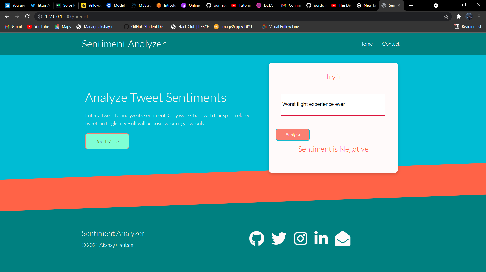

### Result

- This is a NLP project that analyses sentiment from tweets regarding American Airlines companies, it categorises tweets in either positive or negative sentiment.
- Note that this is a learning experiment and not meant to be a professional product.
- To learn the model creation and training, notebook is [Here](./Data_and_model/Tweets_sent.ipynb)
- Created API using Flask [Here](./app.py)
- Has a frontend made using HTML, CSS.

